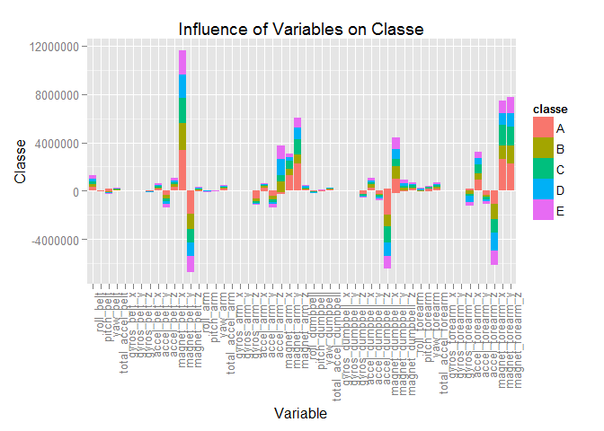
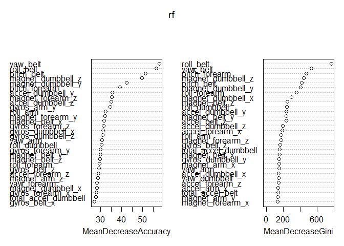

# Practical Machine Learing WriteUp
This writeup is part of Coursera Practical Machine Learning Course offered by John Hopkins University.

###Executive Summary
This writeup uses the Human Activity Recognition (HAR) dataset provided on the course project page. The objective was to condition a model based on a sample dataset of sensor values to later predict the unknown Classe variable.


###Data Source - Loading and Cleaning the Data
The data for this project come from this source: [http://groupware.les.inf.puc-rio.br/har].

The training and test data for this project are available here:

* [https://d396qusza40orc.cloudfront.net/predmachlearn/pml-training.csv]
* [https://d396qusza40orc.cloudfront.net/predmachlearn/pml-testing.csv]


```r
#Load Data
# 1. Download the data files(if don't exist) to the working directory.
# 2. Read the Training and Test Submission data into Data Frame
if (! file.exists('./pml-training.csv')) {
    download.file('http://d396qusza40orc.cloudfront.net/predmachlearn/pml-training.csv', destfile = './pml-training.csv')
}
if (! file.exists('./pml-testing.csv')) {
    download.file('http://d396qusza40orc.cloudfront.net/predmachlearn/pml-testing.csv', destfile = './pml-testing.csv')
}


pml_train <- read.csv('./pml-training.csv')
pml_submit <- read.csv('./pml-testing.csv')

# Hiding the results as details for 160 variables are displayed making this report size big. 
str(pml_train)
```


```r
var_1to7 <- names(pml_train)[1:7]
```

**Initial analysis of above Dataset:**

1. Initial 7 variables are user details and time window when the excercise are done, our intention is just to able to predict using sensor data only. Also in the Prediction data we might have different users and time window so predicting using these variables does not make sense. Please refer below the initial 7 variable names:

  **X, user_name, raw_timestamp_part_1, raw_timestamp_part_2, cvtd_timestamp, new_window, num_window**
  
2. Many numeric variables are actually treated as String as there are empty or "#DIV/0!" values
3. Lots of variable with missing data.

To deal with this, We will discard initial 7 variables, we will convert all these variables(excluding Classe variable) to numeric and we will discard all the variables having large number of missing values. 


```r
#Cleaning Data
# Step 1: Removing first same records containing generic information like name, time, window etc
pml_train <- pml_train[,-c(1:7)]
pml_submit <- pml_submit[,-c(1:7)]

# Step 2: Non-numeric to numeric data(only keeping the outcome variable classe)
 for(i in c(1:(ncol(pml_train)-1))) {pml_train[,i] = as.numeric(as.character(pml_train[,i]))}
 for(i in c(1:ncol(pml_submit))) {pml_submit[,i] = as.numeric(as.character(pml_submit[,i]))}

# Step 3: Removing Columns containing mostly NA values or missing data(more than 50% ie around 9500 records) 
 missing_data_cols <- sapply(c(1:ncol(pml_train)), FUN = function(iCol) (sum(is.na(pml_train[,iCol])) > 9500) )

# Display name of top 10 missing data columns, Top 10 to keep the report space small.
names(pml_train)[missing_data_cols][1:10]
```

```
##  [1] "kurtosis_roll_belt"   "kurtosis_picth_belt"  "kurtosis_yaw_belt"   
##  [4] "skewness_roll_belt"   "skewness_roll_belt.1" "skewness_yaw_belt"   
##  [7] "max_roll_belt"        "max_picth_belt"       "max_yaw_belt"        
## [10] "min_roll_belt"
```

As we see all the columns looks like containing calculated values(min, max, avg, kurt etc.) and if we refer to the document mentioned in * **Human Activity Recognition** (See the Reference section # 2 in this document)*  these are calculated values based on time window. As we already have the predictor variables on which the calculations are made, so we can discard these variables.


```r
 pml_train <- pml_train[, !missing_data_cols]
 pml_submit <- pml_submit[,!missing_data_cols]
```

#### Display the List of Features we will use in our prediction model.

```r
# Display the list of Features we are working with
 names(pml_train)
```

```
##  [1] "roll_belt"            "pitch_belt"           "yaw_belt"            
##  [4] "total_accel_belt"     "gyros_belt_x"         "gyros_belt_y"        
##  [7] "gyros_belt_z"         "accel_belt_x"         "accel_belt_y"        
## [10] "accel_belt_z"         "magnet_belt_x"        "magnet_belt_y"       
## [13] "magnet_belt_z"        "roll_arm"             "pitch_arm"           
## [16] "yaw_arm"              "total_accel_arm"      "gyros_arm_x"         
## [19] "gyros_arm_y"          "gyros_arm_z"          "accel_arm_x"         
## [22] "accel_arm_y"          "accel_arm_z"          "magnet_arm_x"        
## [25] "magnet_arm_y"         "magnet_arm_z"         "roll_dumbbell"       
## [28] "pitch_dumbbell"       "yaw_dumbbell"         "total_accel_dumbbell"
## [31] "gyros_dumbbell_x"     "gyros_dumbbell_y"     "gyros_dumbbell_z"    
## [34] "accel_dumbbell_x"     "accel_dumbbell_y"     "accel_dumbbell_z"    
## [37] "magnet_dumbbell_x"    "magnet_dumbbell_y"    "magnet_dumbbell_z"   
## [40] "roll_forearm"         "pitch_forearm"        "yaw_forearm"         
## [43] "total_accel_forearm"  "gyros_forearm_x"      "gyros_forearm_y"     
## [46] "gyros_forearm_z"      "accel_forearm_x"      "accel_forearm_y"     
## [49] "accel_forearm_z"      "magnet_forearm_x"     "magnet_forearm_y"    
## [52] "magnet_forearm_z"     "classe"
```

#### Display the outcome variable classe.

```r
# Take a look at the Classe labels
 table(pml_train$classe)
```

```
## 
##    A    B    C    D    E 
## 5580 3797 3422 3216 3607
```
As we see classe a factor variable containing 5 levels, This is a example of Classification Problem set that we will be working. 

###Exploratory Data Analysis:

As we have cleaned up the data lets do some Exploratory data analysis on data frame containing 53 variables.

**1. How predictor variables are influencing the outcome Classe**

```r
meltTrain <- melt(pml_train, id.vars = 53)

g <- ggplot(meltTrain, aes(x=factor(variable), y=(value), , fill=classe)) +
      geom_bar(stat="identity") + 
      theme(axis.text.x= element_text(angle=90, hjust=1)) + 
      xlab ("Variable") + ylab("Classe") + 
      ggtitle("Influence of Variables on Classe")

print(g)
```

 

As we observe above the most of the variables influence the outcome variable classe, how ever there are variable names starting with *gyro* , *total* that have almost no influence on the outcome. However we will keep these variables to avoid overfitting and beside keeping these features may be useful when we do more experiments.


### Machine Learning Process
In the sections mentioned below we will do the following steps:

1. Partition the training and testing data.
2. Model Selection - using the Random Forest.
3. Cross validation using the testing data.


####Partition the Data

We first Partition the pml_train data into two partition:

1. The training set is used for training the Machine Learning Algorithm.
2. The testing set we will use for crossvalidating the model.


```r
#Partition Training Data
set.seed(1111)
inTrain <- createDataPartition(y=pml_train$classe, p=0.75, list=FALSE)
training <- pml_train[inTrain,]
testing <- pml_train[-inTrain,]
```

####Model Selection - Random Forest

We are using Random Forest as a model our prediction analysis, the reasons are:

* Random Forests are known for Accuracy
* This is a case of Classification Problem and regression based training will not work.
* This algorithm uses bootstrap sample and grows multiple trees and votes.

We further partition the training set, the reasons are:

1. To speed up the algorithm, as the current data set is large on the machine I am working on, even when trying to use parallel processing hanged my system.
2. So we are passing a sub training data and also the sub testing on which Random Forest function can test.
3. As we can observe we get a fairly good accuracy even using smaller data set(but not too small).


```r
set.seed(1111)
inTrain2 <- createDataPartition(y=training$classe, p=0.8, list=FALSE)
train.subsample <- training[inTrain2,]
train.subtest <- training[-inTrain2,]

# Generate the Random Forest Model
rf <- randomForest(x=train.subsample[,-53], y=train.subsample$classe, xtest=train.subtest[,-53], ytest=train.subtest$classe, importance=TRUE, keep.forest=TRUE) 
```

**Plot the Random Forest**

```r
plot(rf)
```

 

**Plot the Variable Importance**

```r
varImpPlot(rf)
```

 

####Cross Validation

We may now use the rf object to predict the new values in testing set we created.


```r
predclasse <- predict(rf, testing[,-53])
cm <- confusionMatrix(predclasse, testing$classe)
```

#####Print the Confusion Matrix

```
##           Reference
## Prediction    A    B    C    D    E
##          A 1393    2    0    0    0
##          B    2  944    8    0    0
##          C    0    3  846   11    1
##          D    0    0    1  792    1
##          E    0    0    0    1  899
```

#####Accuracy Information

```r
cm$overall
```

```
##       Accuracy          Kappa  AccuracyLower  AccuracyUpper   AccuracyNull 
##         0.9939         0.9923         0.9913         0.9959         0.2845 
## AccuracyPValue  McnemarPValue 
##         0.0000            NaN
```
As we can see the accuracy of our prediction model is approximately 99.388% which is a fairly good model. 

##### Out of Sample Error

```r
#Calculate Accuracy % - > (Count Correct Prediction) * 100 / Total Prediction
sum(predclasse == testing$classe) * 100 / length(predclasse)
```

```
## [1] 99.39
```

```r
#Calculate Out Of Sample Error % -> 100 - Accuracy %  ie. the inverse of Accuracy
100 - (sum(predclasse == testing$classe) * 100 / length(predclasse))
```

```
## [1] 0.6117
```

***Out of Sample Error is: 0.6117***

###Predict the Result on Submit Set 

```r
submitClasse <- predict(rf, pml_submit[,-53])

#Print the Predicted Test Data for this project. 
#Hiding results to avoid spoiler alert.
submitClasse
```
The above set of 20 predicted values got successfully accepted during the course result submition.

###Conclusion
The above selection of Random Forest model with 52 predictors on the reduced(size, # of random  observations) dataset was highly accurate and reasonably faster on lower end machine. We can further reduce the data set like removing the predictor variables with names *gyro* and the Prediction accuracy was similar to that achieved above, I kept them so that to avoid overfitting the results and keeping them was fine in terms of accuracy.
Also tried PCA as few variable showed strong correlation, but the prediction accuracy was too low.


###References:

1. Coursera Practical Machine Learning Course ([https://www.coursera.org/course/predmachlearn])
2. Human Activity Recognition ([http://groupware.les.inf.puc-rio.br/har])

